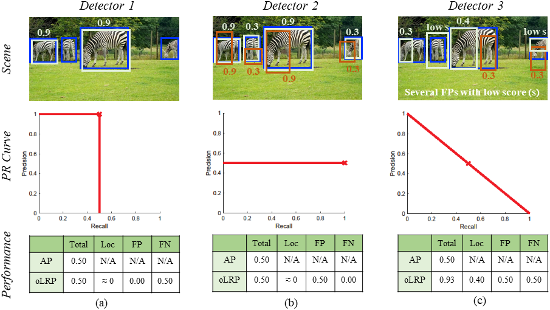

# One Metric to Measure them All: Localisation Recall Precision (LRP) for Evaluating Visual Detection Tasks

The official implementation of LRP Error. This repository provides the implementation of LRP Error on the following evaluation apis:

- Official COCO api [1] to evaluate object detection, keypoint detection and instance segmentation 
- Official COCO panoptic api [2] to evaluate panoptic segmentation 

> [**One Metric to Measure them All: Localisation Recall Precision (LRP) for Evaluating Visual Detection Tasks**](https://arxiv.org/abs/2009.13592),
> [Kemal Oksuz](https://kemaloksuz.github.io/), Baris Can Cam, , [Sinan Kalkan](http://www.kovan.ceng.metu.edu.tr/~sinan/), [Emre Akbas](http://user.ceng.metu.edu.tr/~emre/),
> ([arXiv pre-print](https://arxiv.org/abs/2009.13592))*

For mmdetection COCO api [3] to evaluate object detection, keypoint detection and instance segmentation [see this repository](https://github.com/kemaloksuz/cocoapi).

## How to Cite

Please cite the paper if you benefit from our paper or repository:
```
@article{LRP,
       title = {One Metric to Measure them All: Localisation Recall Precision (LRP) for Evaluating Visual Detection Tasks},
       author = {Kemal Oksuz and Baris Can Cam and Sinan Kalkan and Emre Akbas},
       booktitle = {arXiv},
       year = {2020}
}
```

## Contribution to the Repository

Any contribution to the repository is appreciated. In addition to the datasets and tasks we provide, if you implement LRP Error to evaluate the results of different datasets or different tasks, please follow the subdirectory-based structure of the repository and then make a pull request. Feel free to contact for any question.

## Summary 

In a nutshell, LRP Error (previously proposed only for object detection in [4])

- is an alternative to Average Precision (AP) for object detection, keypoint detection and instance segmentation
- is an alternative to Panoptic Quality (PQ) for panoptic segmentation
- can be extended to evaluate other visual detection tasks such as 3D object detection 
- can be used to assign class-wise optimal thresholds for practical needs

## A Brief Overview of the Paper

In our paper, we first define three important features for a performance measure to evaluate visual object detection tasks; then analyse AP, PQ and LRP based on these features. Finally, again based on these important features, we empirically demonstrate the drawbacks of AP and PQ, and discuss how LRP alleviates their drawbacks.

### Important features for a performance measure

We identfy three important features for a performance measure to evaluate visual object detection tasks as follows:

- **Completeness:** We call a performance measure ''complete'' if it *precisely*  takes into account three most important  performance aspects in a visual detection task, that are false positive rate, false negative rate and localisation error.

- **Interpretability:** Interpretability of a performance measure is related to its ability to provide insights on the strengths and weaknesses of the detector being evaluated.

- **Practicality:** Any issue that arises during  practical use of a performance measure diminishes its practicality.

### Intuition of LRP and Optimal LRP

LRP Error is defined as  the ''average matching error'', where the ''total matching error'' between ground truth set and detection set is normalised by the ''maximum possible value of the total matching error'':
- Total Matching Error: The summation of errors from true positives (TP), false positives (FP) and false negatives (FN). Each TP contributes by its normalised localization error, and, each FP or FN contributes by 1. 
- Maximum Possible Value of the Total Matching Error: Since each TP, FP and FN has a maximum error potential of 1, the maximum possible valur of the total matching error is simply the summation of numbers of TPs, FPs and FNs. 
- Dividing Total Matching Error by Maximum Possible Value of the Total Matching Error yields LRP, and consequently LRP has a range of [0,1].

LRP can directly be used to evaluate panoptic segmentation since the conventional output of panoptic segmentation does not contain confidence scores. As for the outputs with confidence scores (e.g. the outputs of object detection, keypoint detection and instance segmentation), we define Optimal LRP (oLRP) as the minimum achievable LRP Error over the confidence scores. Accordingly, oLRP identifies the optimal configuration and the confidence score corresponding to oLRP is the ''LRP-Optimal Threshold''.

Therefore, LRP replaces PQ and oLRP replaces AP.

### Comparison of LRP with AP and PQ

#### Comparison of oLRP with AP



- **Completeness:** While AP considers localisation quality of TPs *loosely* (i.e. only to validate TPs, thus not *precisely*); oLRP takes into account their localisation qualities precisely (compare the results Detector 1 and Detector 3 in the figure).

- **Interpretability:** While AP does not provide any insight on the detection performance, oLRP is interpretable with its components corresponding to performance aspects. (note that Detector 1 and Detector 2 have very different problems, but equal AP. The components of oLRP is able to address this problem.)

- **Practicality:** We identify three practical issues with AP: (i) AP is not suitable to evaluate outputs without confidence scores (e.g. panoptic segmentation), (ii) AP can not identify a threshold for practical usage of the detectors, and (iii) interpolating the PR curve can affect the performance of the classes with low number of examples.

Please see our paper for a more comprehensive analysis of AP (including COCO-style AP), and its theoretical and empirical comparisons with LRP.

#### Comparison of LRP with PQ

- **Completeness:** Both measures are complete.

- **Interpretability:** RQ component of PQ, defined as the F-measure, combines precision and recall (i.e. does not isolate errors); while LRP has a corresponding component for each performance aspect, and hence provides better interpretability.

- **Practicality:** We identify two issues of PQ related to practicality: (i) PQ is limited to panoptic segmentation, and (ii) PQ overpromotes classification error compared to localisation error inconsistently.

Please see our paper for a more comprehensive analysis of PQ, and its theoretical and empirical comparisons with LRP.

## Specification of Dependencies

- setuptools>=18.0
- cython>=0.27.3 
- matplotlib>=2.1.0
- python3

## Installation

In this repo, we merge using LRP on different tasks and datasets into one repo. Currently, you could install by run

```shell
# Install cocoapi
pip install "git+https://github.com/kemaloksuz/LRP-Error.git#subdirectory=pycocotools"
# Install panopticapi
pip install "git+https://github.com/kemaloksuz/LRP-Error.git#subdirectory=panopticapi"
```

## Using Demo Files (Coming Soon)
For each dataset to use LRP, we provide demo files to facilitate the usage of this repository. Clear explanations will follow.

## Evaluated Models (Coming Soon)

We evaluate the models from the three common repositories: mmdetection [5], detectron [6], detectron [7], and our aLRP Loss implementation [8, 9].

### Evaluated Object Detection Models

|   Model Config  Name   |  Link to Config | Detections | Results | oLRP | oLRP<sub>Loc</sub> | oLRP<sub>FP</sub> | oLRP<sub>FN</sub> | AP<sup>C</sup> | AP<sub>50</sub> | AP<sub>75</sub> | AR<sup>C</sup><sub>100</sub>| model |
| :---------------------------------------------: | :------------: | :-----: | :------------:| :------: | :------------: | :----: | :-------: |:-------: |:------------: | :----: | :-------: |:-------: |
| ssd300_coco.py | [mmdetection](https://github.com/open-mmlab/mmdetection/tree/master/configs/ssd) | [json](https://drive.google.com/file/d/1vt0Gn5El4st31_CUJqq_Gaf1VlLdqpan/view?usp=sharing) |[txt](https://drive.google.com/file/d/1kfXbmKPyoLvtBpFJKPGeIWMGphdYMoWC/view?usp=sharing)| 78.4 | 20.6 | 37.1 | 57.9 | 25.6 | 43.8 | 26.3 | 37.5 | [model](https://drive.google.com/file/d/1pASqIfWRAJICBGW2MPwVW3C8pquA-pqV/view?usp=sharing) |

### Evaluated Keypoint Detection Models 

|   Model  Name   |  Link to Source Repo    | AP  | AP_{50} | AP_{75} | AR  | oLRP  | oLRP_{Loc} | oLRP_{FP} | oLRP_{FN}  | Model  | Result File  |
| :-------------:  | :-----: | :------------: | :------------: | :----: | :-------: |:-------: |:------------: | :----: | :-------: |:-------: | :-------: |

### Evaluated Instance Segmentation Models 

|   Model  Name   |  Link to Source Repo    | AP  | AP_{50} | AP_{75} | AR  | oLRP  | oLRP_{Loc} | oLRP_{FP} | oLRP_{FN}  | Model  | Result File  |
| :-------------:  | :-----: | :------------: | :------------: | :----: | :-------: |:-------: |:------------: | :----: | :-------: |:-------: | :-------: |

### Evaluated Panoptic Segmentation Models 

|    Model  Name   |  Link to Source Repo    | PQ  | SQ | RQ | LRP  | LRP_{Loc} | LRP_{FP} | LRP_{FN}  | Model  |   Result File  |
| :-------------:  | :-----: | :------------: | :------------: | :----: | :-------: |:-------: |:------------: | :----: | :-------: |:-------: |


## License
This project is released under the [Apache 2.0 license](LICENSE).

## References
[1] [cocoapi](https://github.com/cocodataset/cocoapi) of [COCO dataset](http://cocodataset.org/).  
[2] [panopticapi](https://github.com/cocodataset/panopticapi) of [COCO dataset](http://cocodataset.org/).  
[3] [cocoapi](https://github.com/open-mmlab/cocoapi) of [mmdetection](https://github.com/open-mmlab/mmdetection).  
[4] Oksuz K, Cam BC, Akbas E, Kalkan S, Localization recall precision (LRP): A new performance metric for object detection, ECCV 2018.  
[5] [mmdetection](https://github.com/open-mmlab/mmdetection).  
[6] [detectron](https://github.com/facebookresearch/Detectron).  
[7] [detectron2](https://github.com/facebookresearch/detectron2).  
[8] [aLRP Loss Ablation Experiments](https://github.com/kemaloksuz/aLRPLoss-AblationExperiments).  
[9] Oksuz K, Cam BC, Akbas E, Kalkan S, A Ranking-based, Balanced Loss Function Unifying Classification and Localisation in Object Detection, NeurIPS 2020.  

## Contact

This repo is maintained by [Kemal Oksuz](http://github.com/kemaloksuz) and [Baris Can Cam](http://github.com/cancam).
